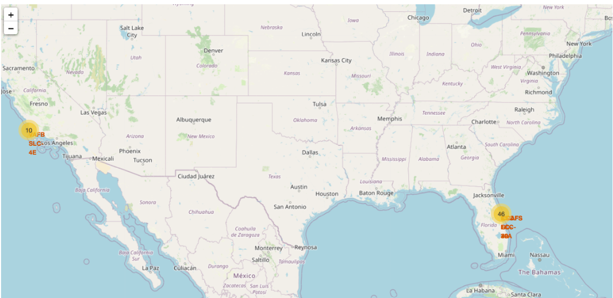
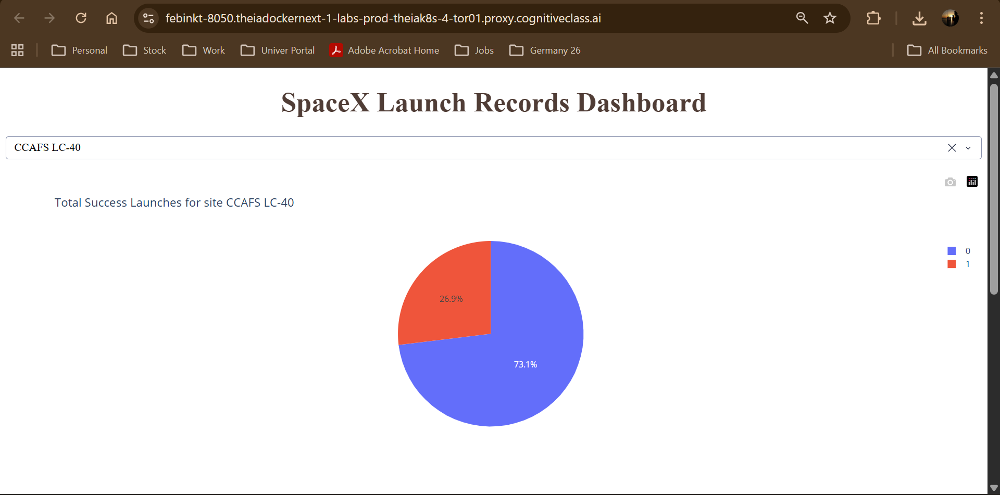
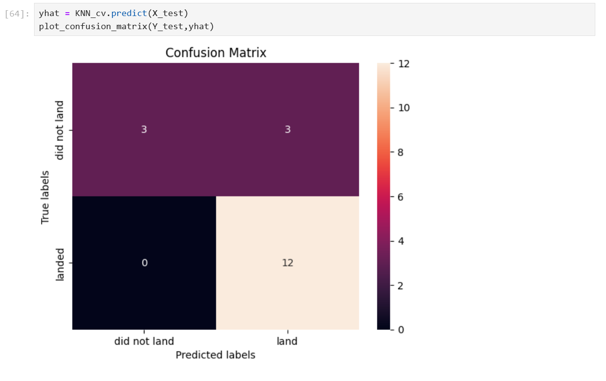

# 🚀 SpaceX Launch Data Analysis & Prediction

This project is part of the IBM Data Science Capstone.  
It explores SpaceX launch data to identify factors influencing mission success and builds predictive models.
## 📂 Repository Structure
- `notebooks/` → Jupyter notebooks for each stage (API, scraping, wrangling, EDA, ML).
- `app/` → Plotly Dash app for interactive visualization.
- `data/` → Datasets used in analysis.
- `screenshots/` → Visual outputs (maps, dashboards, confusion matrix).
## 🛠 Tech Stack
- Python (Pandas, NumPy, Scikit-learn)
- SQL (SQLite)
- Visualization: Matplotlib, Seaborn, Folium, Plotly Dash
- Tools: Jupyter Notebook, GitHub
## 📊 Screenshots of Results
*(Add images into the `screenshots/` folder and link them here)*

- **Folium Map – Global Launch Sites**  
  

- **Plotly Dashboard – Launch Success Pie Chart**  
  

- **Confusion Matrix – Best Performing Model**  
  

## ▶️ Instructions to Run
1. Clone the repository:
2. Install dependencies:
3. Run Jupyter notebooks:
4. Launch the Plotly Dash app:

## 👨‍💻 Author
**Febin** – BCA Graduate, aspiring Data Scientist & ML Engineer  
IBM Data Science Professional Certificate
